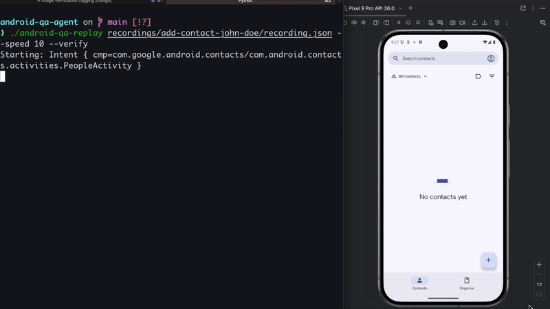

# Android QA Agent

A record-and-replay QA tool for Android. Describe a test scenario in natural language, and Claude Code executes it on an Android device via ADB — transparently recording every command. Recordings can be replayed at configurable speed, with screenshot verification powered by Claude.


<sub>Open the contacts app, add a new contact with name John Doe and phone number +001 1234 5678</sub>

## Prerequisites

- Python 3.8+
- `adb` on your `PATH` (or set `ANDROID_HOME`)
- A running Android emulator or connected device
- [Claude Code](https://claude.com/claude-code)

## Getting Started

Clone the repository:

```bash
git clone git@github.com:tobrun/android-qa-agent.git
```

Open Claude Code from the project directory:

```bash
cd android-qa-agent && claude
```

Prompt Claude Code with a QA scenario. The more detail you provide, the better the test output:

```
open the settings app and toggle dark mode
```

Claude will:

1. Start a recording session, named after the scenario
2. Take UI dumps to find accurate tap coordinates
3. Execute each step via `android-qa`, an ADB gateway that logs every command
4. Claude returns execution and saves the recording to the `recordings/` directory

Claude is generally good at reasoning about the UI and deciding next steps. Providing project-specific instructions in `CLAUDE.md` helps guide it more efficiently.

## Performance Tracking & Tracing

Performance tracking and Perfetto tracing are automatically enabled when your prompt contains relevant keywords — no flags or extra setup needed.

**Performance tracking** captures frame rendering stats (total frames, janky frames, percentile frame times), memory usage, and CPU info via `adb dumpsys`. Include any of these phrases in your prompt:

```
open the settings app and track performance while toggling dark mode
measure performance of scrolling through the contacts list
capture metrics for the login flow, check for frame drops
```

Keywords detected: _track performance_, _capture metrics_, _measure performance_, _frame rate_, _jank_, _memory usage_, _performance metrics_, _fps_, _frame drops_, _rendering_.

**Perfetto tracing** captures a system-level trace (graphics, input, scheduling, memory) that can be visualized at [ui.perfetto.dev](https://ui.perfetto.dev). Include any of these phrases in your prompt:

```
open the maps app and enable tracing while navigating a route
capture a perfetto trace of the onboarding flow
trace the app during the search interaction
```

Keywords detected: _enable tracing_, _systrace_, _perfetto_, _system trace_, _capture trace_, _trace the app_, _tracing_.

Both can be combined in a single prompt:

```
track performance and enable tracing while scrolling through the photo gallery
```

When performance tracking is enabled, frame stats are reset after the app launches so the recording captures clean data. When tracing is enabled, the Perfetto trace runs for the duration of the session and is automatically stopped and pulled when the recording ends.

## Replay and Verification



```bash
./android-qa-replay my-session --speed 5 --verify
```

Replay preserves relative timing between commands, compressed by the speed factor, and aborts on the first command failure.

The `--verify` flag runs Claude in headless mode (`claude -p`) to compare the final screenshot from replay against the one captured during the original recording. This approach tolerates minor visual differences — such as the system clock or transient UI elements — that are unrelated to the test case.

## Project Structure

```
android-qa-agent/
├── android-qa              # ADB wrapper that records commands (Python)
├── android-qa-replay       # Replay tool with optional verification (Python)
├── start-recording         # Session start script
├── stop-recording          # Session stop script
├── recordings/             # Finalized recordings, per session (committable)
│   └── <session>/
│       ├── recording.json  # Commands and metadata (incl. original prompt)
│       └── golden.png      # Last screenshot from the recording
├── artifacts/              # Screenshots and UI dumps (per session)
├── CLAUDE.md               # Claude Code project instructions
├── .claude/
│   ├── settings.json       # Stop hook for auto-finalizing sessions
│   └── skills/             # Claude Code skills
└── .android-qa/            # Runtime state
    └── active-session.json # Lock file (exists only during recording)
```

## Limitations

- Streaming ADB commands (`logcat`, `shell top`, etc.) are not supported.
- Single-threaded: one `android-qa` invocation at a time.
- No stdout/stderr capture — only the command and its metadata are recorded.

## Roadmap

- [x] Multi-device support (current MVP works only on a single ADB device)
- [ ] Multi-step verification — verify screenshots at every step, not just the final result
- [ ] App state cleanup — start each recording and replay from a known fresh state
- [ ] UI dump verification alongside screenshot comparison
- [ ] Complex touch gestures — rotate, pinch, double-tap, and other multi-touch input
- [ ] 3D content testing — `GLSurfaceView`/`TextureView` content is excluded from UI dumps, navigating purely by screenshot has limitations (incorrectly calculating touch points)
- [x] Support for capturing performance metrics through `adb dumpsys`
- [x] Support for capturing perfetto traces

Contributions are welcome — feel free to open a PR!

## License

This project is licensed under the [Apache License 2.0](LICENSE).
